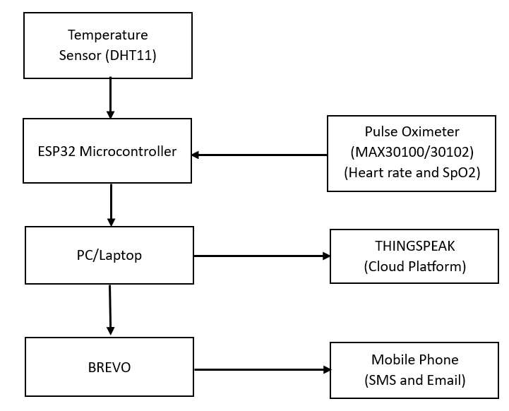
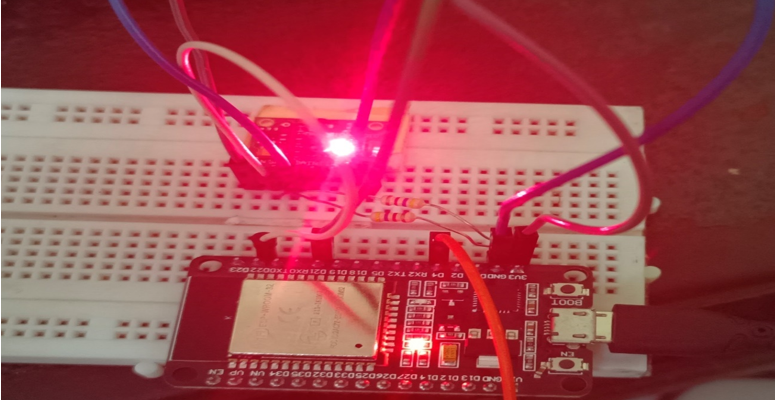
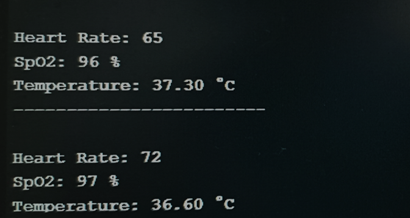

# 🩺 ESP32 Cloud-Integrated Patient Monitoring System

<p align="center">
  
  
  
  
  
  
  
</p>

> **ESP32-based embedded IoT prototype for real-time temperature, heart-rate and SpO₂ monitoring with cloud telemetry and automated alerts.**

## 📌 Overview

This project implements an **ESP32-based IoT monitoring system** that acquires temperature, heart-rate and SpO₂ data using **DHT11** and **MAX30100/MAX30102** sensors.

The ESP32 processes the sensor data and transmits it over Wi-Fi to **ThingSpeak** for cloud visualization. Configurable threshold conditions trigger automated alerts through the **Brevo REST API**.

## ⚙️ Key Features

* 🌡️ Real-time temperature monitoring
* ❤️ Heart-rate and SpO₂ monitoring
* 📡 ESP32 Wi-Fi connectivity
* ☁️ ThingSpeak cloud telemetry
* 🚨 Brevo API alerting
* 🔌 I2C sensor communication
* 🧪 Sensor-data validation
* 📊 Remote monitoring

## 🏗️ System Architecture

<p align="center">
  
</p>

```text
        DHT11 ─────────────┐
                           │
        MAX30100/30102 ────┤
                           ↓
                         ESP32
                           │
                         Wi-Fi
                       ↙       ↘
                ThingSpeak    Brevo API
                  Cloud         Alerts
```

## 🔧 Hardware

| Component      | Interface / Function           |
| -------------- | ------------------------------ |
| ESP32          | Main Controller                |
| DHT11          | Temperature / Humidity — GPIO4 |
| MAX30100/30102 | Heart Rate / SpO₂ — I2C        |
| Breadboard     | Hardware Prototype             |
| USB            | Power                          |

### Pin Configuration

| Component          | ESP32  |
| ------------------ | ------ |
| DHT11 DATA         | GPIO4  |
| MAX30100/30102 SDA | GPIO21 |
| MAX30100/30102 SCL | GPIO22 |
| DHT11 VCC          | 3.3V   |
| MAX30100/30102 VIN | 3.3V   |
| GND                | GND    |

The report documents GPIO4 for DHT11 data and GPIO21/GPIO22 for the MAX30100/30102 I2C interface.

## 💻 Technology Stack

| Category        | Technologies             |
| --------------- | ------------------------ |
| Microcontroller | ESP32                    |
| Firmware        | C/C++                    |
| Development     | Arduino IDE              |
| Sensors         | DHT11, MAX30100/MAX30102 |
| Communication   | Wi-Fi, I2C, HTTP         |
| Cloud           | ThingSpeak               |
| Alerts          | Brevo REST API           |

## 📊 Results

<p align="center">
  
  
</p>

The prototype demonstrated real-time sensor acquisition, ThingSpeak cloud telemetry and automated alert generation through Brevo.

## 🚀 Future Improvements

* 📱 Mobile and wearable monitoring
* 🫀 ECG integration
* 🤖 AI/ML-based predictive analytics
* ☁️ AWS IoT integration
* 🔐 Enhanced security
* 📡 MQTT-based communication

These are proposed future extensions, not current implemented features.

## 🔐 Security

**Never commit Wi-Fi passwords, API keys, tokens or other private credentials.**

The original project implementation contains credential fields that must be replaced with your own private values before deployment.

> ⚠️ **Disclaimer:** This is an educational engineering prototype and is not intended for clinical diagnosis or medical decision-making.

## 📁 Repository Structure

```text
ESP32-Cloud-Patient-Monitoring/
│
├── README.md
├── esp32_patient_monitor.ino
├── architecture.png
├── hardware.jpg
├── thingspeak.png
├── alert.png
└── report.pdf
```

## 👨‍💻 Project Information

**Author:** Dhanusri VEERAPPAN

**Project:** Cloud Integrated Patient Monitoring System

**Domain:** Embedded Systems • IoT • Cloud Connectivity

**Platform:** ESP32

**Development:** Arduino IDE

**Academic Project:** Puducherry Technological University

**Year:** 2024

---

<p align="center">
  <b>Embedded Systems • IoT • Sensor Integration • Cloud Connectivity</b>
</p>
